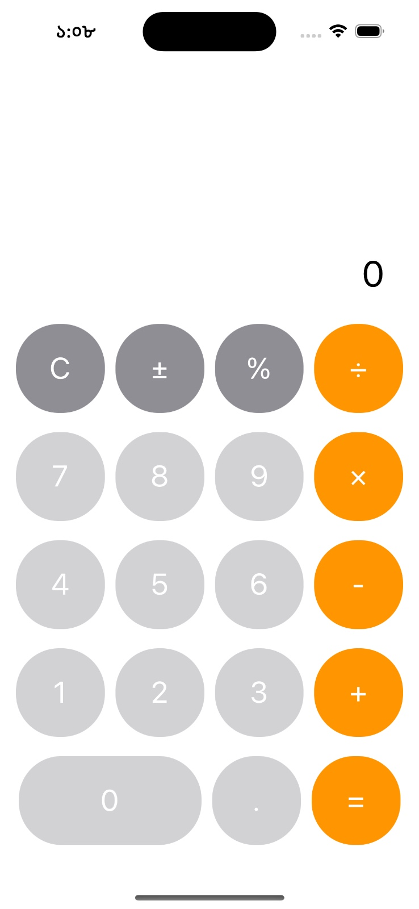
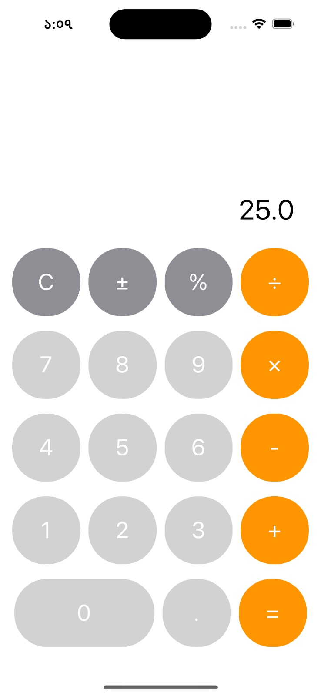

# Basic Calculator

A simple calculator application built using Swift. This calculator performs basic arithmetic operations and showcases a simple, clean user interface.

## Features

- Addition, subtraction, multiplication, and division operations
- Clear button to reset calculations
- Basic, user-friendly UI

# Screenshots

<div style="display: flex; gap: 10px;">
    
    
</div>

## How to Run

1. Clone the repository:
   ```bash
   git clone https://github.com/MDTAHSINURRAHMAN/calculator
